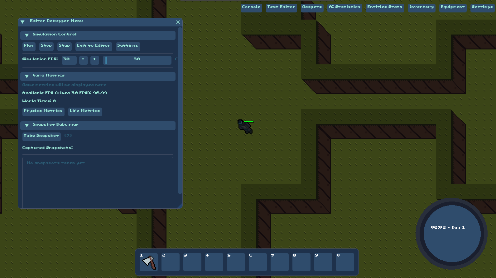

##  Aetherion — C++ Engine with Python Bindings




Aetherion is the native C++ engine and runtime designed to bridge the gap between classic and modern sandbox simulations. It builds C++ components and exposes a Python extension via nanobind (Python module: `_aetherion`). This document explains system and Conda deps, how to build, test, and a minimal usage example surfaced as a unit test.

**Quick summary**
- Python module name: `_aetherion`
- Recommended Conda env: `aetherion-312`
- Build system: CMake (out-of-tree), optional Makefile helpers, Docker for system deps

---

**Table of contents**
- Project overview
- System dependencies
- Conda environment
- Build (CMake + Makefile)
- Docker (build environment image)
- Testing and minimal Python example
- Troubleshooting
- Developer notes

---

## Project Overview

Aetherion contains native C++ subsystems (terrain, physics, ecosystem, rendering helpers) and exposes a Python extension built with `nanobind` as `_aetherion`. The repo also generates FlatBuffers headers and supports building a `world_test` native executable.

## System dependencies

Install system packages using your distribution's package manager (Ubuntu/Debian example below). Many libraries are required by CMake and for optimal performance:

- build tools: `build-essential`, `cmake`, `ninja-build`, `pkg-config`, `git`
- graphics/input: `libsdl2-dev`, `libsdl2-image-dev`, `libsdl2-ttf-dev`, OpenGL dev headers
- concurrency & libs: `libtbb-dev`, `libeigen3-dev`, `libboost-all-dev`
- serialization & db: `libmsgpack-dev`, `libmsgpack-cxx-dev`, `liblmdb-dev`, `sqlite3` dev
- logging & utils: `libspdlog-dev`, `libfmt-dev`, `zlib1g-dev`, `libblosc-dev`
- FlatBuffers: `flatc` (or build FlatBuffers from source)
- OpenVDB: recommended to build from source or install a compatible system package (CMake defaults to `/usr/local/include/openvdb` and `/usr/local/lib/libopenvdb.so`)

Ubuntu example (copy/paste):

```bash
sudo apt-get update
sudo apt-get install -y build-essential cmake ninja-build pkg-config git \
  libsdl2-dev libsdl2-image-dev libsdl2-ttf-dev libgl1-mesa-dev \
  libtbb-dev libeigen3-dev libboost-all-dev libmsgpack-dev libmsgpack-cxx-dev \
  liblmdb-dev libspdlog-dev libfmt-dev zlib1g-dev libblosc-dev sqlite3 libsqlite3-dev
```

Note: `flatc` (FlatBuffers compiler) must be available on `PATH`. The included Dockerfile builds FlatBuffers and OpenVDB when required.

### Third-party libraries (`libs/`) — vcpkg manifest + git

Header-only **EnTT** and **FlatBuffers** sources are pinned via [vcpkg.json](vcpkg.json) / [vcpkg-lock.json](vcpkg-lock.json) (baseline + overrides), built with a **full** `microsoft/vcpkg` clone at that baseline (required for the version database). The installer materializes trees under `libs/` so **CMake does not need to change**.

**nanobind** is cloned from Git at `NANOBIND_REF` in [third_party.lock](third_party.lock) (not via the vcpkg port), so we avoid pulling the vcpkg **python3** dependency chain; this matches the engine’s vendored `libs/nanobind` layout.

**Hybrid (not vcpkg):** **imgui** / **implot** / **ImGuizmo** stay as your existing source or snapshots under `libs/` (or add them the same way you always have). Only EnTT + FlatBuffers use vcpkg for version locking.

```bash
# From aetherion/ — requires: git, cmake, ninja, curl
./scripts/install_third_party_libs.sh
```

Caches default next to the repo: `.vcpkg` (tool clone + checkout), `.vcpkg_cache`, `.vcpkg_installed`. Override with `VCPKG_ROOT`, `VCPKG_CACHE_ROOT`. For CI binary artifacts directory, set `VCPKG_BINARY_SOURCES` (see workflow).

## Conda environment

Use the provided `environment.yml` to create the Conda environment used for building/testing. The project expects `CONDA_PREFIX` to be set or a named env matching the expected path.

Recommended steps:

```bash
# create env (one-time)
conda env create -f environment.yml

# activate env
conda activate aetherion-312

# verify python + numpy + nanobind are available
python -c "import sys, numpy; print(sys.version, numpy.__version__)"
```

Notes:
- CMake looks for `CONDA_PREFIX` to set `CMAKE_PREFIX_PATH`. If you use a different env name or custom prefix, export `CONDA_PREFIX` or set `PREFIX_PATH`/`.env` (see Makefile) before running CMake.
- Some projects historically used `life-sim-312` — prefer `aetherion-312` for the engine to avoid confusion.

## Build (CMake + Makefile helpers)

Primary build method (recommended): from the `aetherion/` directory, run:
```
make build
```
This wrapper runs the package build in the `aetherion-312` Conda environment and is the easiest, repeatable way to produce the Python package/extension.

Prefers out-of-source builds. `PREFIX_PATH` (or `CONDA_PREFIX`) should point to your conda environment root so CMake finds Python, NumPy and other conda-installed libs.

Minimal CMake flow:

```bash
# set prefix if not using CONDA_PREFIX
export PREFIX_PATH="$CONDA_PREFIX"  # or set to your conda env path
cmake -S . -B build -DCMAKE_PREFIX_PATH="$PREFIX_PATH"
cmake --build build --parallel
```

To build with Ninja and skip the world_test (Makefile helper does this):

```bash
rm -rf build
mkdir build && cd build
cmake -G Ninja -DBUILD_WORLD_TEST=OFF -DCMAKE_PREFIX_PATH="$PREFIX_PATH" ..
ninja
cd ..
```

Makefile shortcuts (run from `aetherion/`):

- `make build` — runs `conda run -n aetherion-312 python -m build` (Python packaging step)
- `make build-test` — configures with Ninja and runs `pytest tests`
- `make build-and-install` — runs `scripts/build_and_install.sh` (wrapping preferred install flow)
- `make install-package` / `make conda-install` — local copy-based installation helpers (legacy)

Important CMake notes:
- `nanobind_add_module(_aetherion MODULE ...)` builds the `_aetherion` extension
- FlatBuffers schemas are compiled at build time; `flatc` must be present on PATH
- OpenVDB paths default to `/usr/local`; adjust `OPENVDB_INCLUDE_DIR` and `OPENVDB_LIBRARIES` via CMake cache or environment if your OpenVDB is installed elsewhere

## Docker (reproducible dev image)

The included `Dockerfile` creates an Ubuntu-based image that builds OpenVDB and FlatBuffers and creates the Conda env `aetherion-312`. It is useful when system packages are hard to satisfy locally.

### CI: cached OpenVDB base image

OpenVDB is expensive to build from source, so CI publishes a reusable base image containing OpenVDB under `/usr/local`. The main CI base image then builds “on top of” this OpenVDB image, which keeps rebuilds fast when OpenVDB hasn’t changed.

- OpenVDB base Dockerfile: `Dockerfile.openvdb`
- CI base Dockerfile: `Dockerfile` (uses `ARG OPENVDB_BASE_IMAGE=...` then `FROM ${OPENVDB_BASE_IMAGE}`)

Local workflow (from repo root):

```bash
# 1) Build the OpenVDB base image (one-time or when OpenVDB build inputs change)
docker build -f Dockerfile.openvdb --target openvdb-runtime -t aetherion-openvdb:openvdb-11.0.0 .

# 2) Build the CI/dev base image on top of OpenVDB
docker build -f Dockerfile -t aetherion-ci:local .
```

Optional: reuse the cached OpenVDB base image from GHCR (skips the expensive local OpenVDB build):

```bash
docker build -f Dockerfile . \
  --build-arg OPENVDB_BASE_IMAGE=ghcr.io/arthurmoreno/aetherion-openvdb:openvdb-11.0.0 \
  --progress=plain
```

Build and run the image (from repo root):

```bash
docker build -f Dockerfile -t aetherion-dev:latest .
docker run -it --rm aetherion-dev:latest
```

Inside the container the `aetherion-312` env will be available and active (the Dockerfile configures the shell to activate it).

## Testing and minimal Python example

Run local automated tests + badge refresh (canonical command):

```bash
make test-badges
```

This runs tests with coverage (`coverage.xml`, `htmlcov/`), records the latest local test status (`.test_status`), and regenerates local README badges under `_images/`.

Quick fallback (tests only):

```bash
# config + run tests
make build-test
# canonical local test command (coverage + status marker)
make test-ci
# or from within an activated env and after building the extension
pytest tests
```

Minimal unit test (verifies the nanobind module imports). Add this file as `tests/test_aetherion_import.py`:

```python
# tests/test_aetherion_import.py
def test_import_aetherion():
  import importlib
  _aetherion = importlib.import_module("_aetherion")
  # basic smoke checks
  assert _aetherion is not None
  assert hasattr(_aetherion, "__name__")

```

This simple test ensures the compiled extension is importable from the active Python environment. Replace the attribute assertion with any known exported symbol when available (e.g. `initialize`, `EntityInterface`, etc.).

## Troubleshooting

- CMake fatal error "Could not detect a conda environment": ensure `CONDA_PREFIX` is set or activate your conda env before running CMake.
- `flatc compiler not found`: install FlatBuffers or build it from source; ensure `flatc` is on `PATH`.
- OpenVDB: if you see missing OpenVDB headers/libs, build OpenVDB from source (Dockerfile demonstrates this) or install a distro/system package and set `OPENVDB_INCLUDE_DIR` and `OPENVDB_LIBRARIES` accordingly.
- libstdc++ compatibility: if you encounter runtime symbol/version issues, avoid downgrading libstdc++ globally — prefer isolating by using the Conda environment or the Docker image.
- Naming ambiguity: the repo contains references to `lifesimcore` (packaging stubs) and the built module is `_aetherion`. Decide on the canonical packaging name for release (see Developer notes).

## Developer notes

- Stub generation: CMake emits `_aetherion.pyi` using `nanobind_add_stub`. The Makefile also contains a `generate-stubs` rule for `lifesimcore.pyi` using `nanobind.stubgen`.
- The Makefile contains legacy copy-based install helpers (`install-package`, `conda-install`) — consider refactoring to a proper wheel/pip flow (`python -m build`, `pip install dist/*.whl`).
- The build generates FlatBuffers headers in the build tree (`generated/`) — keep those in the build directory and do not commit generated headers.

## Common commands

```bash
# create & activate env
conda env create -f environment.yml
conda activate aetherion-312

# out-of-source cmake build
cmake -S . -B build -DCMAKE_PREFIX_PATH="$CONDA_PREFIX"
cmake --build build --parallel

# run python tests
pytest tests

# run local automated test + badge refresh
make test-badges

# docker (if system deps fail locally)
docker build -f aetherion/Dockerfile -t aetherion-dev:latest .
docker run -it --rm aetherion-dev:latest
```

## What I need from you to finalize

- Confirm the canonical Python package name (should the pip/wheel be `aetherion` or `lifesimcore`?).
- Confirm OpenVDB preferred install strategy (system package vs build-from-source). If you want I can add step-by-step OpenVDB build instructions.
- Provide a representative exported symbol from `_aetherion` to include a concrete example usage (beyond import smoke test).

---

If you want I will:
1. Add the `tests/test_aetherion_import.py` file to the repo and run `pytest` locally (if you want me to run tests here, confirm the environment to use). 
2. Replace legacy Makefile install steps with a `pip install` wheel workflow.

Which of those should I do next? 

